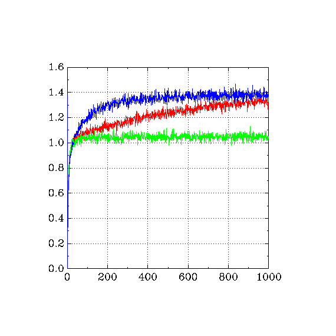

# Section 2.3 - The 10-armed Testbed
Implementation of a k-armed bandit.

Figure 2.2 on Page 29 can be recreated by running the program three times with `EPS` definitions: 0.0, 0.01, 0.1

After running the main program three times, run the `graph_2.3.sh` bash script to plot results with `graph` from GNU plot utils.
Results match Figure 2.2:

