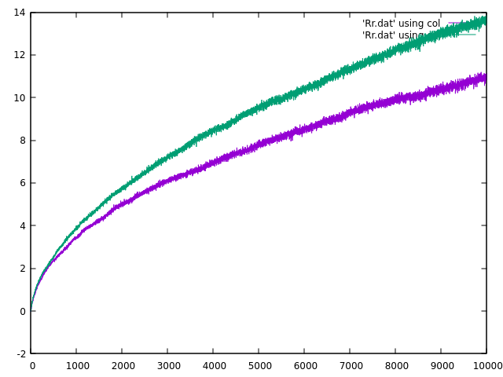

# Section 2.5 - Nonstationary Comparison
Building on k-armed bandit from 2.3, implement Exercise 2.5 to train two bandits on a nonstationary problem and compare sample average vs. weighted average.

Run main program for SAMPLE_AVERAGE: 0,1. Then run `graph_2.5.sh` to graph results (now using `gnuplot`):

