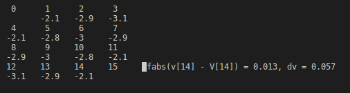

# Chapter 4 - Policy Evaluation and Improvement (MDP)
Run `./build.sh && ./main`

Curses window will launch in terminal. Press 'q' to quit, or press any other key to continuously step through policy evaluation.

Results similar to Figure 4.1:

