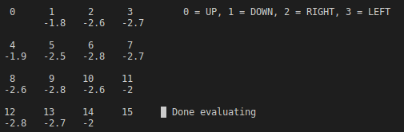

# Chapter 4 - Policy Evaluation in Gridworld (Example 4.1)

## Implementation
Performs policy *evaluation* only. Policy *improvement* remains elusive. Uses threshold theta = 0.5, and discounted return gamma = 0.7.

Evaluates until dV < theta, then interactively acts out a greedy policy for each state.

## Run
Run `./build.sh && ./main`

Curses window will launch in terminal. Press 'q' to quit, or press any other key to continuously step through policy evaluation.

Results similar to Figure 4.1:

Testing greedy policy after evaluation:

