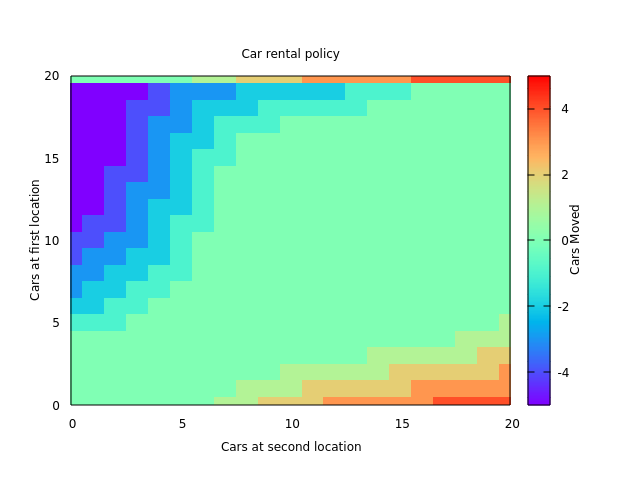

# Section 4.3 - Example 4.2 Jack's Car Rental (Policy Iteration)

## Implementation
Algorithm based on https://github.com/ShangtongZhang/reinforcement-learning-an-introduction/blob/master/chapter04/car_rental.py

## Run
Run `./build.sh && ./main`

It will take a while to train. Then run `./graph_4.2.sh`. It should produce a plot with similar results to Figure 4.2 of the text.

