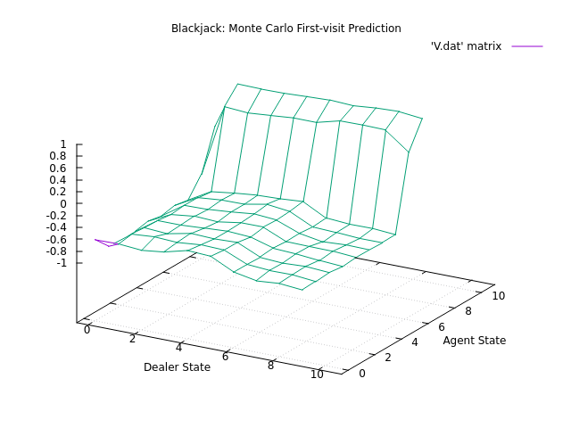

# Section 5.1 - Example 5.1 Blackjack (First Visit Monte Carlo)

## Implementation
There is a full blackjack simulation game that will run in your terminal using 'curses'.
Changed macro `TRAIN_AGENT_OR_PLAY_BLACKJACK` to 0 if you wish to play blackjack against dealer.
This simulation will hopefully be used in coming blackjack examples to play against both the dealer
and the trained agent.

Keep as 1 to generate state-value matrix based on Example 5.1.

## Run
Run `./build.sh && ./main && ./graph_5.1.sh`

A graph will generate that matches Figure 5.1:

