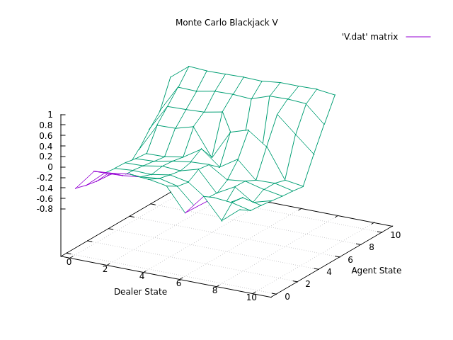
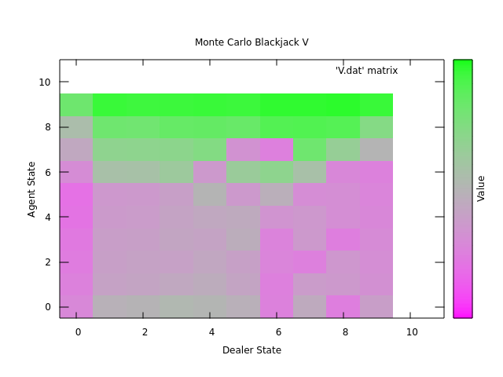
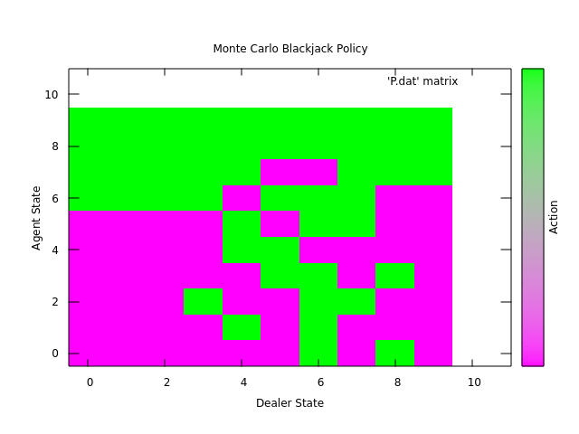

# Section 5.3 - Example 5.3 Solving Blackjack (Monte Carlo Control)

## Requirements
Large static arrays (as used in previous examples) were causing stack smashing.
Switched to dynamically allocated arrays via `libvolk`.

Install on Ubuntu (and its derivates): `sudo apt install libvolk2-bin libvolk2-dev`

Install on Arch: `sudo pacman -S libvolk`

## Run
Run `./build.sh && ./main && ./graph_5.3.sh`

A graph will generate that is similar Figure 5.3 (usable ace V*):

Replot the state-value function (V*) as a heatmap to better understand it:

The policy, however, is very different to that in the book.
Legend: Stick is 1 (green), Hit is 0 (magenta):

